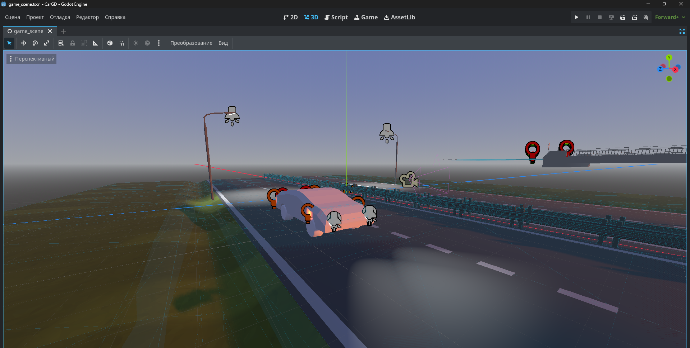
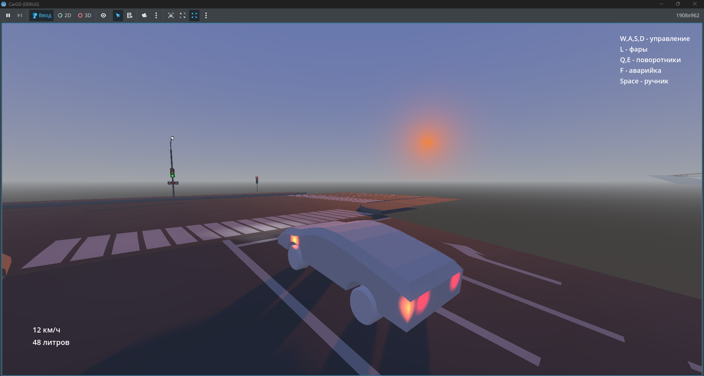

# CarGD - Godot 4 Car Controller  
**Реалистичный симулятор автомобиля с коробкой передач, расходом топлива и светофором**  

## О проекте  
Этот репозиторий содержит готовую к использованию сцену с полностью настроенным контроллером автомобиля, построенным на основе `VehicleBody3D` в Godot Engine 4. Включает в себя физику движения, коробку передач, систему расхода топлива и управление светофором.  

## Можно использовать!  
Готовая сцена, 3D-модель, программный код — всё предоставляется свободно для любых целей:  
* Изучайте механику автомобилей в Godot  
* Дорабатывайте и улучшайте  
* Встраивайте в свои проекты (аркады, симуляторы гонок и т.д.)  
* Используйте как основу для собственных наземных транспортных средств  
Единственная просьба: **указывайте меня как автора** (PRAVDA_SEMPAI).  

## ✨ Особенности  
* **Готовая сцена:** Всё уже настроено и готово к запуску  
* **Коробка передач:** Автоматического переключения  
* **Расход топлива:** Моделируется в зависимости от мощности двигателя и стиля вождения  
* **Разнообразный функционал:** Отдельные настройки для ускорения, торможения, руля и звуков  
* **Система светофора:** Настраиваемые состояния (зеленый, желтый, красный), таймеры и переключение сигналов  
* **Детальное управление:** Управление мощностью, тормозами, рулём и переключением передач  
* **Динамический звук двигателя:** Реагирует на скорость и нагрузку  

## 🕹️ Управление  
* **W / S** — Ускорение / Замедление  
* **A / D** — Поворот руля влево / вправо  
* **Q / E** — Поворотники 
* **Space** — Тормоз  
* **F** — Аварийка 

## 📸 Скриншоты  
  
   

## 📱 Соцсети  
Следите за обновлениями и другими проектами:  
[[YouTube](https://www.youtube.com/@pravda_sempai)]  
[[Rutube](https://rutube.ru/channel/41737058/)]  
[[VK](https://vk.com/pravdasempai)]  
[[Telegram](https://t.me/PRAVDASEMPAI)]  

## Лицензия  
**Свободное использование с указанием авторства.**  
Можете использовать сцену, модель и код для некоммерческих и коммерческих проектов при условии указания автора **PRAVDA_SEMPAI**.  

---  
**Автор: PRAVDA_SEMPAI**
